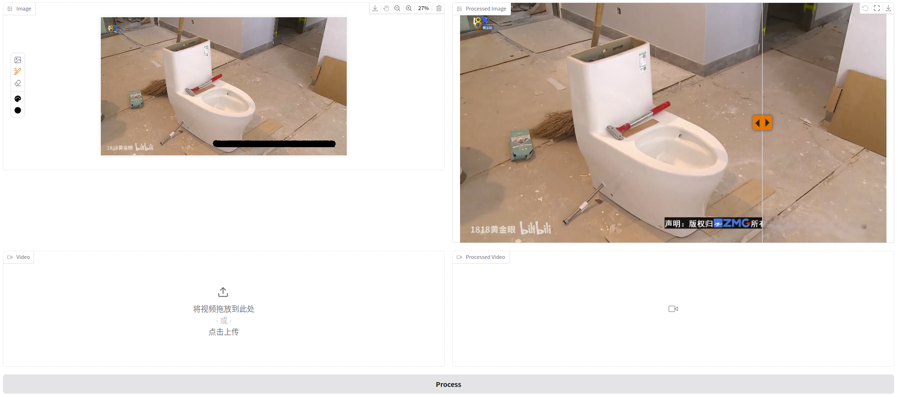

# Watermark Remover

  

## Install & Run
- `git clone https://github.com/HtwoOtwo/watermark-remover.git`
- `pip install -r requirements.txt`
- `cd watermark-remover`
- `python app.py`

## Process Image
Upload the image, use the brush to paint over the watermark, and click the "Process" button.

PS: It also supports object removal, and works better for small objects.

## Process Video
Upload the video, the first frame of the video will be displayed in the Image area, use the brush to paint on the watermark, and click the "Process" button.

PS: Currently, static watermark removal is supported, but there are consistency issues with video watermark removal.